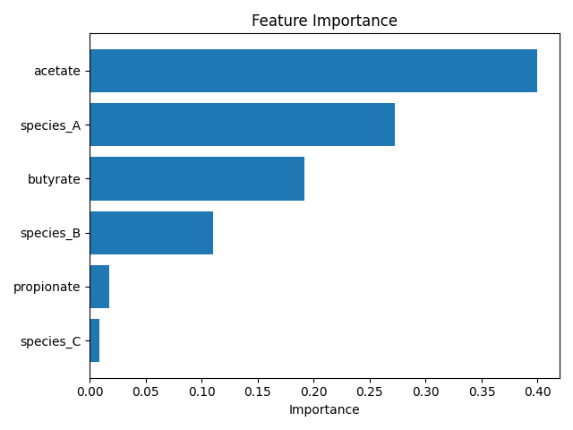
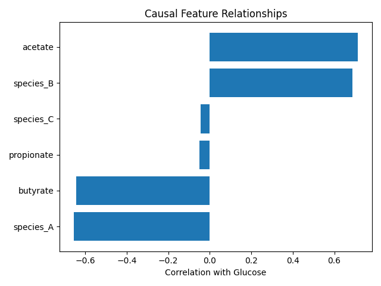

# 🧬 Nutri Multi-Omics Nextflow Pipeline

A reproducible computational biology pipeline integrating microbiome, metabolomics, and clinical data to model host metabolic responses.

---

## 🚀 Features

- Multi-omics data integration
- Predictive modeling (Random Forest)
- Correlation-based causal analysis
- Reproducible workflow using Nextflow

---

## 🔬 Biological Objective

To understand how microbiome composition and metabolites influence host glucose response.

---

## ⚙️ Workflow

Microbiome + Metabolomics + Clinical Data  
→ Integration  
→ Predictive Modeling  
→ Feature Importance  
→ Causal Interpretation  

---

## 📊 Results

### Feature Importance


### Correlation Analysis


---

## 🧠 Key Findings

- species_A is associated with lower glucose (beneficial)
- species_B and acetate are associated with higher glucose
- Microbiome and metabolites jointly influence host metabolism

---

## ▶️ Run Pipeline

```bash
nextflow run main.nf
```

---

## 🛠️ Tech Stack

- Nextflow
- Python (pandas, scikit-learn, matplotlib)
- Git

---

## 📌 Future Work

- Add mechanistic modeling (ODE / metabolic networks)
- Integrate real microbiome datasets
- Expand to multi-cohort analysis